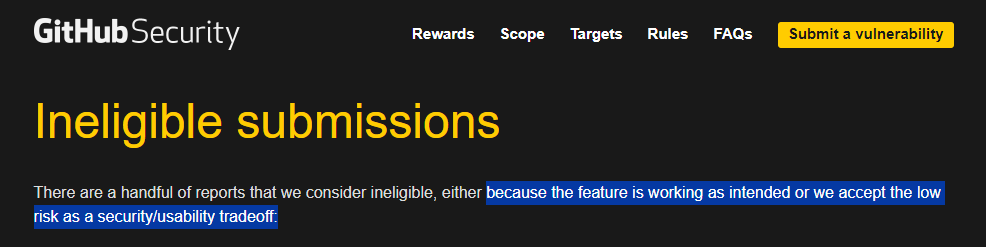
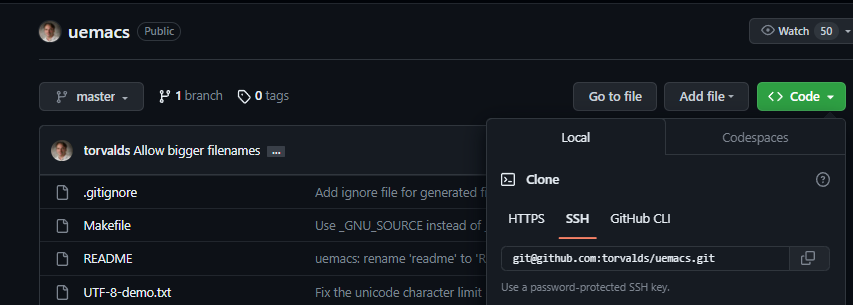

# Contents

1. [Define Content Spoofing](https://github.com/BeckTimothy/hacking-github-demo/blob/master/CONTENT_SPOOFING.md#content-spoofing)
2. [How Git and GitHub handle authentication](https://github.com/BeckTimothy/hacking-github-demo/blob/master/CONTENT_SPOOFING.md#how-git-and-github-handle-authentication)
3. [Why GitHub considers it a feature and not an exploit](https://github.com/BeckTimothy/hacking-github-demo/blob/master/CONTENT_SPOOFING.md#githubs-stance-on-content-spoofing)
4. [How to impersonate someone](https://github.com/BeckTimothy/hacking-github-demo/blob/master/CONTENT_SPOOFING.md#how-one-would-impersonate-someone---for-science-of-course)


⠀
⠀


# Content Spoofing

"Content spoofing, also referred to as content injection, “arbitrary text injection” or virtual defacement, is an attack targeting a user made possible by an injection vulnerability in a web application. When an application does not properly handle user-supplied data, an attacker can supply content to a web application, typically via a parameter value, that is reflected back to the user. This presents the user with a modified page under the context of the trusted domain. This attack is typically used as, or in conjunction with, social engineering because the attack is exploiting a code-based vulnerability and a user’s trust. As a side note, this attack is widely misunderstood as a kind of bug that brings no impact." [via OWASP docs](https://owasp.org/www-community/attacks/Content_Spoofing)

In short though, by impersonating another, one could deface a brand by making inflammatory comments, or they could use victim's credibility to take advantage of their followers or create clout. 


⠀
⠀


# How Git and GitHub handle Authentication

GitHub is a bunch of tools built on top of Git. Git authenticates you using ssh keys (usually) when you push/pull commits to/from the remoite repo. So the software authenticates you when you access the remote repository, not when you make a commit. 

When it comes to the commit, Git and Github displays the user(s) associated with commits by email regardless of authentication. It displays the user tied to the user.email config for the git client making the commit. In the case of multiple committers; the users tied to the emails associated in `Co-authored-by: NAME <NAME@EXAMPLE.COM>` lines in the commit message trailer.  

```bash
 git commit -m "Making example commit.
>
>
Co-authored-by: NAME <NAME@EXAMPLE.COM>
Co-authored-by: ANOTHER-NAME <ANOTHER-NAME@EXAMPLE.COM>"
```
⠀
see: [Github docs for creating commits with multiple authors](https://docs.github.com/en/pull-requests/committing-changes-to-your-project/creating-and-editing-commits/creating-a-commit-with-multiple-authors)


# GitHubs stance on Content Spoofing

GitHub officially claims that content spoofing by "impersonating a user through Git email address" as either "feature is working as intended or we accept the low risk as a security/usability tradeoff" [via GitHub bug bounty program](https://bounty.github.com/ineligible.html)



GitHub doesn't see content spoofing as a problem, most likely, because they've implemented this 'verified' status, by signing commits with [GPG key pairs](https://docs.github.com/en/authentication/managing-commit-signature-verification/signing-commits), which few people use. Far too few people use GPG keys, and far too few projects require you to use this, and it's not enabled by default so when a commit isn't signed it's content is not seen as less credible by the majority.

⠀
⠀


# How one would impersonate someone - for science of course

In short all you do is update the Git config variable `user.email` and GitHub will attribute later commits to the account associated with the email given to them in said commits.

1. To get your victim's email, you can grab it from a commit log by finding a repo in which the victim has contributed

    

2. Then cloning said repo

    

3. Finally, just check the Git log for all your PII needs.

    

4. Now that you have an email associated with a victim's GitHub account you'll want to use the Git CLI to change the Git config variables associating the user with the commit. Use the following commands to do so:

```bash
git config --global user.email "your_email@abc.example"
git config --global user.name "your_name"
```

You'll forever be committing as the GitHub account associated with "your_email@abc.example", and if that doesn't exist, you'll be committing as "your_name".

Have fun and maybe don't go making inflammatory commit messages. Please.
