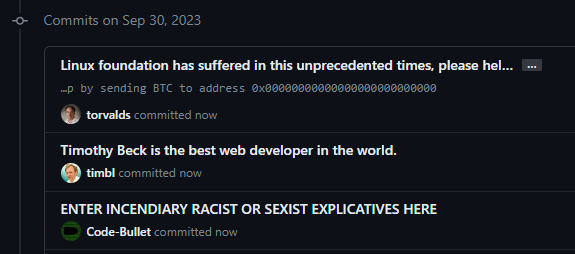

# Contents

1. [Define Content Spoofing](https://github.com/BeckTimothy/dontTrustContributionCharts/blob/master/CONTENT_SPOOFING.md#content-spoofing)
2. [How Git and GitHub handle authentication](https://github.com/BeckTimothy/dontTrustContributionCharts/blob/master/CONTENT_SPOOFING.md#how-git-and-github-handle-authentication)
3. [Why GitHub considers it a feature and not an exploit](https://github.com/BeckTimothy/dontTrustContributionCharts/blob/master/CONTENT_SPOOFING.md#githubs-stance-on-content-spoofing)
4. [How to impersonate someone](https://github.com/BeckTimothy/dontTrustContributionCharts/blob/master/CONTENT_SPOOFING.md#how-one-would-impersonate-someone---for-science-of-course)


⠀
⠀


# Content Spoofing

"Content spoofing, also referred to as content injection, “arbitrary text injection” or virtual defacement, is an attack targeting a user made possible by an injection vulnerability in a web application. When an application does not properly handle user-supplied data, an attacker can supply content to a web application, typically via a parameter value, that is reflected back to the user. This presents the user with a modified page under the context of the trusted domain. This attack is typically used as, or in conjunction with, social engineering because the attack is exploiting a code-based vulnerability and a user’s trust. As a side note, this attack is widely misunderstood as a kind of bug that brings no impact." [via OWASP docs](https://owasp.org/www-community/attacks/Content_Spoofing)

In short though, by impersonating another, one could deface a brand by making inflamatory comments, or they could use victim's credibility to take advantage of their followers or create clout. 



⠀
⠀


# How Git and GitHub handle Authentication

GitHub hosts remote Git repos for you. Through their settings you can add cryptographic keys to your account as authentication on the back-end this is really just using Git's authentication, but because you've uploaded your key to the server, every commit you make with that key active is tied to your GitHub account.

When it comes to commits, GitHub sees the key associated with the account and commit when pushing and attaches that contribution to the account owning the key pair. But then it does something janky, GitHub displays the GitHub account tied to the user.email config variable given with each commit. As opposed to displaying the GitHub account tied to the key that pushed those commits to the remote repo. 


⠀
⠀


# GitHubs stance on Content Spoofing

GitHub officially claims that content spoofing by "impersonating a user through Git email address" as either "feature is working as intended or we accept the low risk as a security/usability tradeoff" [via GitHub bug bounty program](https://bounty.github.com/ineligible.html)


⠀
⠀


# How one would impersonate someone - for science of course

In short all you do is update the Git config variable `user.email` and GitHub will attribute later commits to the account associated with the email given to them in said commits.

1. To get your victim's email, you can grab it from a commit log by finding a repo in which the victim has contributed

    

2. Then cloning said repo

    

3. Finally, just check the Git log for all your PII needs.

    

4. Now that you have an email associated with a victim's GitHub account you'll want to use the Git CLI to change the Git config variables associating the user with the commit. Use the following commands to do so:

```bash
git config --global user.email "your_email@abc.example"
git config --global user.name "your_name"
```

You'll forever be committing as the GitHub account associated with "your_email@abc.example", and if that doesn't exist, you'll be committing as "your_name".

Have fun and maybe don't go making inflammatory commit messages. Please.
