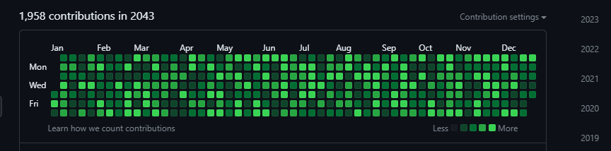

# Contents

1. [What is *Contribution Fraud*](https://github.com/BeckTimothy/dontTrustContributionCharts/blob/master/CONTRIBUTION_FRAUD.md#what-is-contribution-fraud)
2. [How can it be used](https://github.com/BeckTimothy/dontTrustContributionCharts/blob/master/CONTRIBUTION_FRAUD.md#why-would-someone-do-contribution-fraud)
3. [How to perform contribution fraud](https://github.com/BeckTimothy/dontTrustContributionCharts/blob/master/CONTRIBUTION_FRAUD.md#how-to-perform-contribution-fraud)
4. [Limitations](https://github.com/BeckTimothy/dontTrustContributionCharts/blob/master/CONTRIBUTION_FRAUD.md#limitations)
5. [How to undo contribution fraud](https://github.com/BeckTimothy/dontTrustContributionCharts/blob/master/CONTRIBUTION_FRAUD.md#how-to-undo-contribution-fraud)

# What is *Contribution Fraud*

*Gasp!* they used the word fraud. It must be illegal, immoral, or scary... Fact is I decided to call it fraud because that's what it is. Through this hack we're fraudulently specifying information about our commits, we aren't breaking any laws, we aren't breaking any TOU/EULA, your morals and internet ethics are irrelevant here. I decided to call this contribution fraud, but specifically we're talking about fraudulently defining the time of which commits say they are made through the use of Git configuration variables. 

# Why would someone do Contribution Fraud

There are a few reasons why someone would want to fake their contributions, but it all boils down to this chart:


Recruiters and hiring agencies sometimes obsess about your 'GitHub pulse' and keeping this chart active. Unless your end goal is management, it's more important to focus on learning and developing your coding chops and networking skills than to obsess about some lame analytics. Managers disregard, we know you love turning the most ridiculous data into KPIs.

Sometimes You may be interested in advertising something about yourself and this banner could be a fun and nerdy way of doing that:


# How to perform Contribution Fraud

Git utilizes a few environment variables to overwrite the current date when tracking changes or commiting changes.
By setting these environment variables in your CLI, all following commits made in that environment will be made with those specified dates. GitHub will honor the dates provided by Git in your contribution chart.
```bash
export GIT_AUTHOR_DATE=$(date -d'2020-02-02 12:00:00')      
export GIT_COMMITTER_DATE="$GIT_AUTHOR_DATE"  
```

Additionally, you may be interested in making empty commits where you commit no changes if you're automating the commit process. You may also be interested in making a commit with no commit message. There are flags for the Git commit command to make this possible:
```bash
git commit --allow-empty --allow-empty-message -m 'test_message_for_02-02-2020' 
```

# Limitations

When automating the creation of a vast amount of commits over a period of time you may run into a few limitions. A few to mention are:

1. Git will automatically squash commits into a single commit if you make more than 1000 (or maybe equal to 1000) commits before pushing. I resolved this issue by pushing every 990-999 commits made. 
2. There's a minimum and maximum date GitHub will track. No contributions will show up if made after Dec 31st, 2099. The code will still exist in the repo, the green dot just won't show up on your chart. The earliest time is the beginning of unix time, imposed by Git as it doesn't recognize previous dates as a valid date format. 
3. Only contributions from main/master or whatever you decided to name your root branch will show up on your GitHub contribution chart.
4. While you can automate contribution activity, public repo code changes can be audited, and someone interested in looking at your public repo may be curious enough to see what exactly you're making changes to. Contributions to private repos however show up as "n contributions in private repositories."
5. Bash scripting on windows is reaaally slow. My decade old ubuntu laptop made 36,000 commits in just a couple minutes, while my windows workstation with ridiculous hardware only made 160,000 commits running overnight. It may be a PEBKAC issue though. I use Git bash for my CLI needs, someone running WSL may have a different experience.

# How to undo Contribution Fraud

Hahaha, you just run that one Git command:
```bash
git gud
```
Joking aside, you have to delete the repo the repo. You can try using the below series of git commands to squash all your commits and replace master, but there's no guaruntee your contribution chart will reflect that for every commit; you may solve this by pushing your codebase to a new repo after squashing then deleting the old repo. Either way you're losing the entire commit history of that repo, but this way you'll keep the code changes. So plan ahead and don't go nuking the commit history of an important repo. :)

```bash
git checkout --orphan temp # create a copy of current branch without its commit history
git commit -m "First commit" # commit changes to temp
git branch -f master # copy the local branch to master
git checkout master # switch to master branch
git branch -d temp # delete the temp branch
git push 
```
