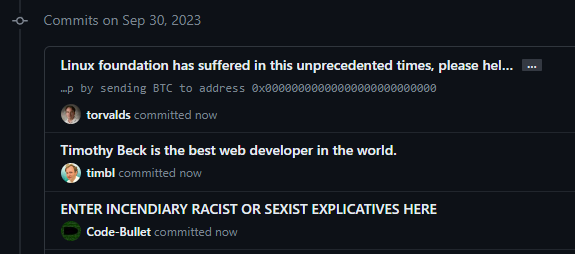
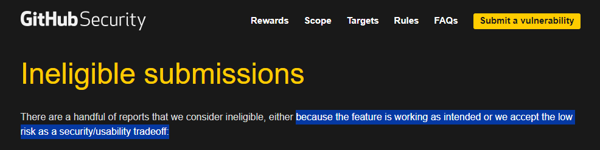
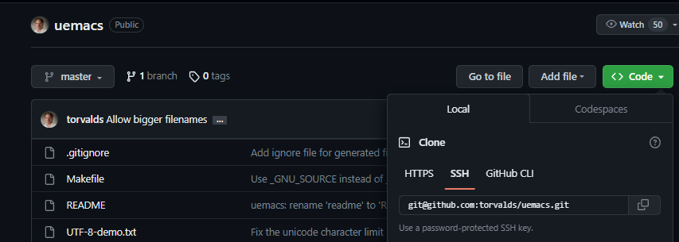
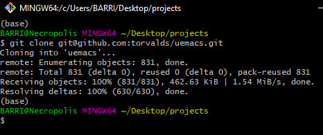
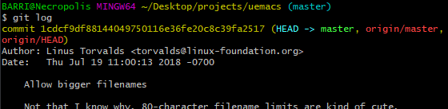
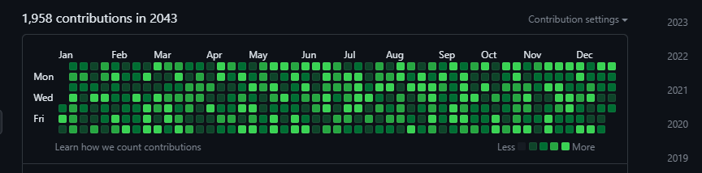

# Purpose

I've built this repo to support some presentations shared with: 
- **Albuquerque Lowtech's Anonymous** (a hacker collective located in Albuquerque, New Mexico)
- **Albuquerque Software Social Club** (a meetup group for Albuquerque developers,)
- The **Albuquerque chapter of Google Developer Groups**.

The purpose of this information is to bring awareness to Git, Git variables, some ethical grey areas in the use of git variables. The information here is for educational use only. I am in no way encouraging finding shady ways to use your knowledge. Do what you will at your own risk.

# Contents

1. [Git vs GitHub](https://github.com/BeckTimothy/hacking-github-demo#git-vs-github)
2. [Git Environment Variables](https://github.com/BeckTimothy/hacking-github-demo#git-environment-variables)

3. [What is *Content Spoofing*](https://github.com/BeckTimothy/hacking-github-demo#content-spoofing)
4. [How Git and GitHub handle authentication](https://github.com/BeckTimothy/hacking-github-demo#how-git-and-github-handle-authentication)
5. [Why GitHub considers it a feature and not an exploit](https://github.com/BeckTimothy/hacking-github-demo#githubs-stance-on-content-spoofing)
6. [How to impersonate someone](https://github.com/BeckTimothy/hacking-github-demo#how-one-would-impersonate-someone---for-science-of-course)

7. [What is *Contribution Fraud*](https://github.com/BeckTimothy/hacking-github-demo#what-is-contribution-fraud)
8. [How can it be used](https://github.com/BeckTimothy/hacking-github-demo#why-would-someone-do-contribution-fraud)
9. [How to perform contribution fraud](https://github.com/BeckTimothy/hacking-github-demo#how-to-perform-contribution-fraud)
10. [Limitations](https://github.com/BeckTimothy/hacking-github-demo#limitations)
11. [How to undo contribution fraud](https://github.com/BeckTimothy/hacking-github-demo#how-to-undo-contribution-fraud)


# Git vs GitHub

Similarly to how JavaScript is a programming language and Java is the first layer of hell; Git and GitHub are two completely different things.

Git is an open-source distributed version control software. It's used to allow people to coordinate and develop projects in conjunction asynchronously and manage a protocol for syncing their work together and managing versions of that work. GitHub, is a product trying to be many things, but it's built on top of Git, utilizing it as cloud storage. While trying to be many things, it's important to always remember, GitHub is just the graveyard where dead projects go to die.

# Git Environment Variables

When I talk about Git environment variables I'm talking about two different things:
1. [Configuration Variables](https://git-scm.com/docs/git-config#_variables) you set for your Git client. The git-config docs' variable section has a word count exceeding 33,000 and lists a whole bunch of different useful configuration variables for controlling the behavior of git on your machine.  
2. [Environment variables](https://git-scm.com/book/en/v2/Git-Internals-Environment-Variables) you set for your CLI instance. Git runs inside a bash shell, and looks for specific environment variables set to change Git's behavior in certain ways.

For the purpose of this Repo we are exploring the behaviors of a specific few environment/config variables:

1. Environment variables GIT_AUTHOR_DATE and GIT_COMMITTER_DATE and explore a hack to contribution time travel within [CONTRIBUTION_FRAUD.md](https://github.com/BeckTimothy/hacking-github-demo/blob/master/CONTRIBUTION_FRAUD.md) 
2. Config Variables user.email and user.name and a content spoofing hack within [CONTENT_SPOOFING.md](https://github.com/BeckTimothy/hacking-github-demo/blob/master/CONTENT_SPOOFING.md)


# Content Spoofing

"Content spoofing, also referred to as content injection, “arbitrary text injection” or virtual defacement, is an attack targeting a user made possible by an injection vulnerability in a web application. When an application does not properly handle user-supplied data, an attacker can supply content to a web application, typically via a parameter value, that is reflected back to the user. This presents the user with a modified page under the context of the trusted domain. This attack is typically used as, or in conjunction with, social engineering because the attack is exploiting a code-based vulnerability and a user’s trust. As a side note, this attack is widely misunderstood as a kind of bug that brings no impact." [via OWASP docs](https://owasp.org/www-community/attacks/Content_Spoofing)

In short though, by impersonating another, one could deface a brand by making inflammatory comments, or they could use victim's credibility to take advantage of their followers or create clout.



⠀
⠀


# How Git and GitHub handle Authentication

GitHub is a bunch of tools built on top of Git. Git authenticates you using ssh keys (usually) when you push/pull commits to/from the remoite repo. So the software authenticates you when you access the remote repository, not when you make a commit.

When it comes to the commit, Git and Github displays the user(s) associated with commits by email regardless of authentication. It displays the user tied to the user.email config for the git client making the commit. In the case of multiple committers; the users tied to the emails associated in `Co-authored-by: NAME <NAME@EXAMPLE.COM>` lines in the commit message trailer.

```bash
 git commit -m "Making example commit.
>
>
Co-authored-by: NAME <NAME@EXAMPLE.COM>
Co-authored-by: ANOTHER-NAME <ANOTHER-NAME@EXAMPLE.COM>"
```
⠀
see: [Github docs for creating commits with multiple authors](https://docs.github.com/en/pull-requests/committing-changes-to-your-project/creating-and-editing-commits/creating-a-commit-with-multiple-authors)


# GitHubs stance on Content Spoofing

GitHub officially claims that content spoofing by "impersonating a user through Git email address" as either "feature is working as intended or we accept the low risk as a security/usability tradeoff" [via GitHub bug bounty program](https://bounty.github.com/ineligible.html)



GitHub doesn't see content spoofing as a problem, most likely, because they've implemented this 'verified' status, by signing commits with [GPG key pairs](https://docs.github.com/en/authentication/managing-commit-signature-verification/signing-commits), which few people use. Far too few people use GPG keys, and far too few projects require you to use this, and it's not enabled by default so when a commit isn't signed it's content is not seen as less credible by the majority.

⠀
⠀


# How one would impersonate someone - for science of course

In short all you do is update the Git config variable `user.email` and GitHub will attribute later commits to the account associated with the email given to them in said commits.

1. To get your victim's email, you can grab it from a commit log by finding a repo in which the victim has contributed

   

2. Then cloning said repo

   

3. Finally, just check the Git log for all your PII needs.

   

4. Now that you have an email associated with a victim's GitHub account you'll want to use the Git CLI to change the Git config variables associating the user with the commit. Use the following commands to do so:

```bash
git config --global user.email "your_email@abc.example"
git config --global user.name "your_name"
```

You'll forever be committing as the GitHub account associated with "your_email@abc.example", and if that doesn't exist, you'll be committing as "your_name".

Have fun and maybe don't go making inflammatory commit messages. Please.


# What is *Contribution Fraud*

*Gasp!* they used the word fraud. It must be illegal, immoral, or scary... Fact is I decided to call it fraud because that's what it is. Through this hack we're fraudulently specifying information about our commits, we aren't breaking any laws, we aren't breaking any TOU/EULA, your morals and internet ethics are irrelevant here. I decided to call this contribution fraud, but specifically we're talking about fraudulently defining the time of which commits say they are made through the use of Git configuration variables.

# Why would someone do Contribution Fraud

There are a few reasons why someone would want to fake their contributions, but it all boils down to this chart:


Recruiters and hiring agencies sometimes obsess about your 'GitHub pulse' and keeping this chart active. Unless your end goal is management, it's more important to focus on learning and developing your coding chops and networking skills than to obsess about some lame analytics. Managers disregard, we know you love turning the most ridiculous data into KPIs.

Sometimes You may be interested in advertising something about yourself and this banner could be a fun and nerdy way of doing that:


# How to perform Contribution Fraud

Git utilizes a few environment variables to overwrite the current date when tracking changes or committing changes.
By setting these environment variables in your CLI, all following commits made in that environment will be made with those specified dates. GitHub will honor the dates provided by Git in your contribution chart.
```bash
export GIT_AUTHOR_DATE=$(date -d'2020-02-02 12:00:00')      
export GIT_COMMITTER_DATE="$GIT_AUTHOR_DATE"  
```

Additionally, you may be interested in making empty commits where you commit no changes if you're automating the commit process. You may also be interested in making a commit with no commit message. There are flags for the Git commit command to make this possible:
```bash
git commit --allow-empty --allow-empty-message -m 'test_message_for_02-02-2020' 
```

# Limitations

When automating the creation of a vast amount of commits over a period of time you may run into a few limitations. A few to mention are:

1. Git will automatically squash commits into a single commit if you make more than 1000 (or maybe equal to 1000) commits before pushing. I resolved this issue by pushing every 990-999 commits made.
2. There's a minimum and maximum date GitHub will track. No contributions will show up if made after Dec 31st, 2099. The code will still exist in the repo, the green dot just won't show up on your chart. The earliest time is the beginning of unix time, imposed by Git as it doesn't recognize previous dates as a valid date format.
3. Only contributions from main/master or whatever you decided to name your root branch will show up on your GitHub contribution chart.
4. While you can automate contribution activity, public repo code changes can be audited, and someone interested in looking at your public repo may be curious enough to see what exactly you're making changes to. Contributions to private repos however show up as "n contributions in private repositories."
5. Bash scripting on Windows is reaaally slow. My decade old ubuntu laptop made 36,000 commits in just a couple of minutes, while my Windows workstation with ridiculous hardware only made 160,000 commits running overnight. It may be a PEBKAC issue though. I use Git bash for my CLI needs, someone running WSL may have a different experience.

# How to undo Contribution Fraud

Hahaha, you just run that one Git command:
```bash
git gud
```
Joking aside, you have to delete the repo. You can try using the below series of git commands to squash all your commits and replace master, but there's no guarantee your contribution chart will reflect that for every commit; you may solve this by pushing your codebase to a new repo after squashing then deleting the old repo. Either way you're losing the entire commit history of that repo, but this way you'll keep the code changes. So plan ahead and don't go nuking the commit history of an important repo. :)

```bash
git checkout --orphan temp # create a copy of current branch without its commit history
git commit -m "First commit" # commit changes to temp
git branch -f master # copy the local branch to master
git checkout master # switch to master branch
git branch -d temp # delete the temp branch
git push 
```
